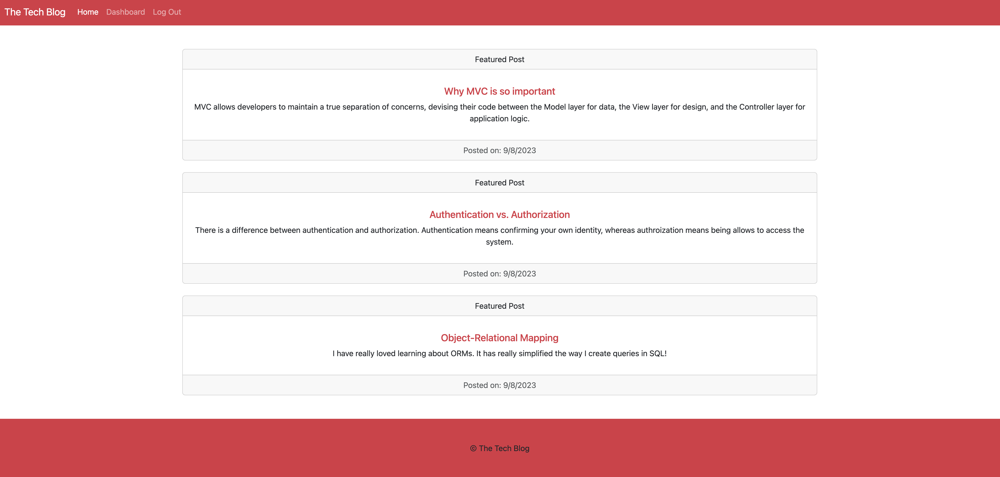

# The Tech Blog

## Description
This application utilizes mysql, sequelize, Node.js, express.js, and handlebars for a CMS-style blog site. This site is meant for developers to publish posts and comment on other developers' posts. This app follows the MVC paradigm.

## Usage
This application is used by answering questions through Inquirer in the user's command line. 

Screenshot: 

Deployed Site: [Link](https://full-stack-tech-blog-express-fe43e7b93740.herokuapp.com/posts/1) 

## License
This application is unlicensed.

## Contact Information

* Email: nicolestark1103@gmail.com
* GitHub: nstark12